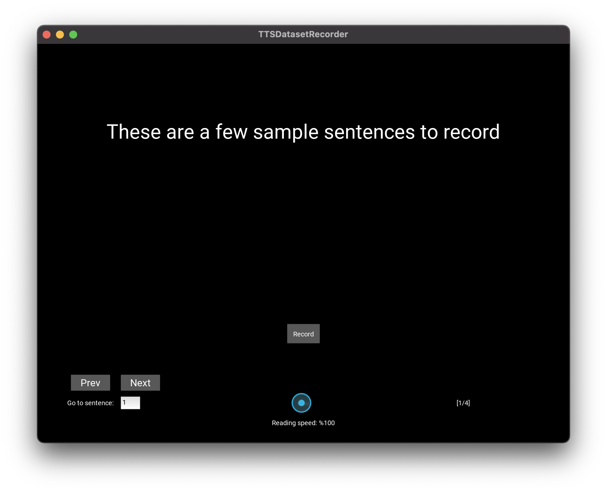

# TTS Dataset Recorder

This is a simple app for recording homebrew TTS datasets, implemented in Python using [Kivy](https://kivy.org/). The designed use case is to display the text line by line and record a fixed duration of audio from the default microphone based on the displayed text length. Reading speed is adjustable and the text can be navigated by simple controls in case a sentence needs to be re-recorded due to noise, speaker error etc.

I only tested this on Mac OS and Ubuntu, I think it can run on Windows with small modifications. I also didn't test the GUI well and hard-coded the widget sizes and paddings, so the app might look funky at different window sizes and desktop resolutions. 

## Installation
Requires Python 3.

```
pip install -r requirements.txt
```

## Usage

```
python prompter.py
```
The app will read the text in `text.txt` in the same folder and display it line by line. Press the `Record` button and say the sentence while the `Recording...` text is displayed. Recording will automatically stop after some time. If the allotted time is too little or too much, you can adjust it for your reading speed using the slider. The recordings will be saved as `.wav` files at 48000 kHz in `~/Desktop/TTS_dataset_recordings`, with the file names corresponding to line numbers in `text.txt`

